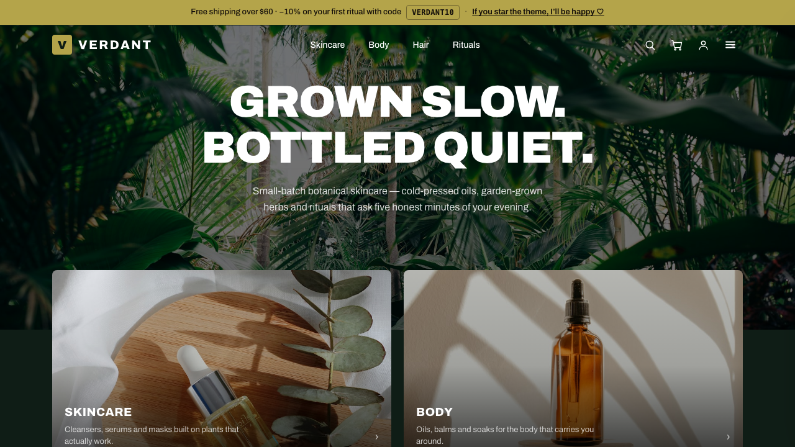

# astro-njx-boutique — editorial fashion theme for Astro

A complete boutique storefront built with **Astro 5 + Tailwind CSS v4**: serif editorial
typography, full-bleed imagery, oxblood accents — wired for **Shopify** out of the box and
deployable to **Cloudflare Pages** (or any static host) in minutes.

**Live demo → [astro-njx-boutique.pages.dev](https://astro-njx-boutique.pages.dev)**
Everything in the demo — bag, checkout, search, favorites, dark mode — is this theme running on mock data.



## What is this?

astro-njx-boutique is a **static storefront**: Astro renders every page to plain HTML at
build time, so the site is fast by default and hosting is essentially free. Product data
comes from a pluggable provider — start with the bundled JSON catalog, then flip one
environment variable and the same pages build from your **real Shopify store**, with
Shopify's hosted checkout handling payments.

Made for small fashion brands, ateliers and boutiques that want an editorial custom
storefront without running a server.

## Features

- 👗 **Full boutique flow** — full-bleed hero, collection shelf, catalog with client-side
  tag filters (with piece counts) & sorting, product pages with sizes, sticky 3:4 gallery
  + lightbox, related pieces
- 🛍 **Working bag** — persistent (localStorage), quick-add from cards, quantity controls,
  line remove, clear all; hands off to Shopify's hosted checkout
- 🔌 **Two data providers, one switch** — `COMMERCE_PROVIDER=mock` (bundled JSON, no
  accounts needed) or `shopify` (live products over the Storefront API)
- 🔎 **Instant search** — inline index, opens with `/`, zero network requests
- ❤️ **Favorites** — heart any piece, badge counter, dedicated `/favorites` page
- 🌗 **Light & dark theme** — one click, no flash on reload
- 🤝 **Trust details on every product** — shipping, returns and repairs lines, all from config
- 📝 **All copy in two constants files** — rebrand every text on the site without touching markup
- 📄 **20 pages total** — about, contacts, FAQ, account UI, privacy, terms, honest 404
- ⚡️ **Zero client framework** — a few small vanilla scripts; no React/Vue/hydration cost

| Catalog | Dark |
| --- | --- |
|  |  |

## Quick start

```bash
git clone https://github.com/njbSaab/astro-njx-boutique.git my-boutique
cd my-boutique
npm install
cp .env.example .env        # defaults to the mock catalog
npm run dev                 # http://localhost:4321
```

That's it — the boutique runs on the bundled demo catalog (`src/data/mock-catalog.json`).
Edit that file to see your own pieces immediately.

## Connect your Shopify store

1. In Shopify admin: **Settings → Apps and sales channels → Develop apps → Create an app.**
2. Give it the *Storefront API* scopes (unauthenticated read products/collections/checkouts).
3. Install the app and copy the **Storefront API access token** (this token is public-safe).
4. Update `.env`:

```bash
COMMERCE_PROVIDER=shopify
PUBLIC_SHOPIFY_DOMAIN=your-store.myshopify.com
PUBLIC_SHOPIFY_STOREFRONT_TOKEN=xxxxxxxxxxxxxxxx
```

5. `npm run build` — the same pages now build from your live catalog, and the bag creates
   a real Shopify cart and redirects to your hosted checkout.

The provider interface lives in `src/lib/commerce/` — adding WooCommerce, Medusa or your
own API means implementing one small TypeScript interface.

## Deploy

Any static host works. For Cloudflare Pages:

```bash
npm run build
npx wrangler pages deploy dist --project-name my-boutique
```

Set the same env vars in your host's dashboard for CI builds. The whole boutique fits
comfortably in Cloudflare's free tier.

## Make it yours

- **All copy in two files** — every piece of text lives in `src/constants/components.ts`
  (header, footer, drawers, bag, search) and `src/constants/pages.ts` (home, about, FAQ,
  product page, …). Rebrand the whole boutique without touching a single component.
- **Brand & colors** — design tokens in `src/styles/global.css` (`@theme` block, dark
  overrides in `.dark`; radius tokens are flattened for the editorial look — restore them
  for a softer feel). Fonts load in `src/layouts/Layout.astro`.
- **Catalog** — `src/data/mock-catalog.json` + photos in `public/products/`, or connect Shopify.
- **Layout & sections** — plain `.astro` files: header/footer/drawers in
  `src/layouts/Layout.astro`, one file per page in `src/pages/`.

## Project structure

```
src/
├── constants/
│   ├── components.ts           # all copy for the shell: header, footer, bag, search…
│   └── pages.ts                # all copy per page: home, about, FAQ, legal…
├── data/mock-catalog.json      # demo pieces & collections
├── layouts/Layout.astro        # header, footer, bag/nav drawers, search
├── components/ProductCard.astro
├── lib/
│   ├── commerce/               # provider interface + mock & shopify implementations
│   ├── cart.ts                 # persistent bag (nanostores)
│   └── favorites.ts            # persistent favorites
└── pages/                      # index, collections/, products/, about, faq, …
```

## Sibling theme & Pro

Prefer a general-goods look? **[astro-njx-store](https://github.com/njbSaab/astro-njx-store)**
is the same engine with a warm paper-and-pine design. An extended **Pro** version (customer
accounts, reviews, more sections) is on the way — watch the repo to get notified.

## Credits

Made by [njX](https://njxui.dev) — also the author of [njx-ui](https://njxui.dev), a
classless-friendly CSS library for landings. Photos: [Unsplash](https://unsplash.com).

If this theme saves you time, a ⭐️ on GitHub genuinely helps it reach more people.
